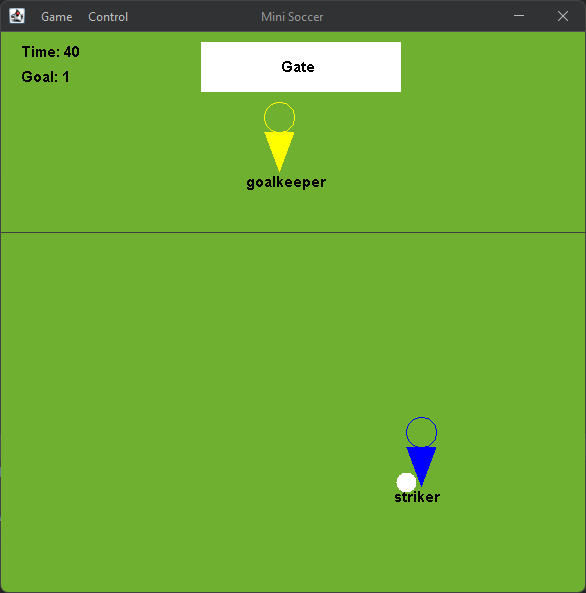
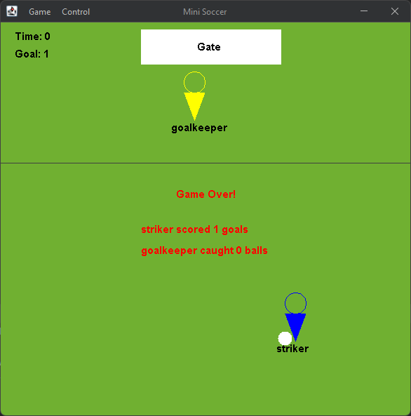

[](https://github.com/a-mohamad/soccer-game/actions/workflows/codecov.yml)

# Mini Soccer Game

A mini soccer game written in Java 16 using Java Swing.

Featuring design pattern/principle:

* Singleton
* Iterator
* Factory
* Sorting
* Collection
* Polymorphism
* Inheritance

## Interface
| In game    | Game over   |
| :------------: | :----------: |
|  |  |

## How To Use

### Controls
Use the  <kbd>&#8592;</kbd> <kbd>&#8593;</kbd> <kbd>&#8594;</kbd> to control the movement of the `Striker`.

Use the <kbd>Space</kbd> to shoot bar with the `Stiker`.

### Menu shortcuts
- <kbd>N</kbd> to create a new game
- <kbd>Q</kbd> to exit the application
- <kbd>P</kbd> to pause the game
- <kbd>R</kbd> to resume the game

## Documentation
- [Design report](https://github.com/a-mohamad/soccer-game/blob/main/Documentation/report/report.pdf)

## How To Run
https://user-images.githubusercontent.com/75959959/140392172-e9c6f2fe-7990-443f-aa9d-551b84c3afb0.mp4

or 


```
./gradlew run
```


